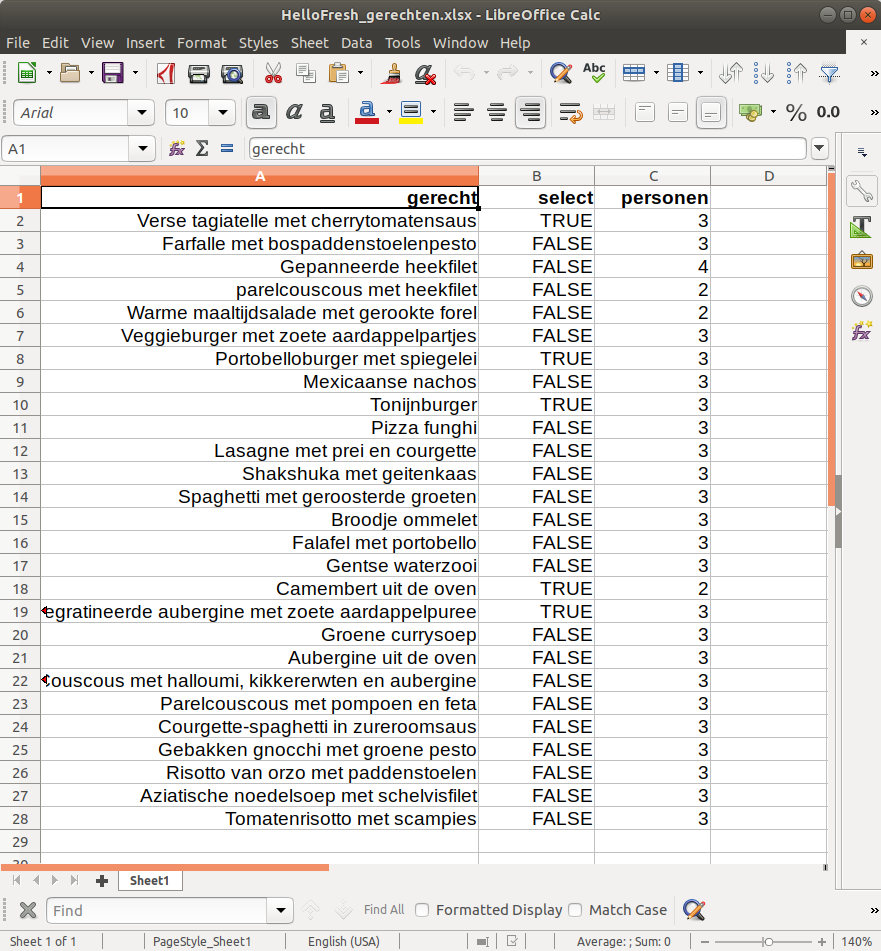
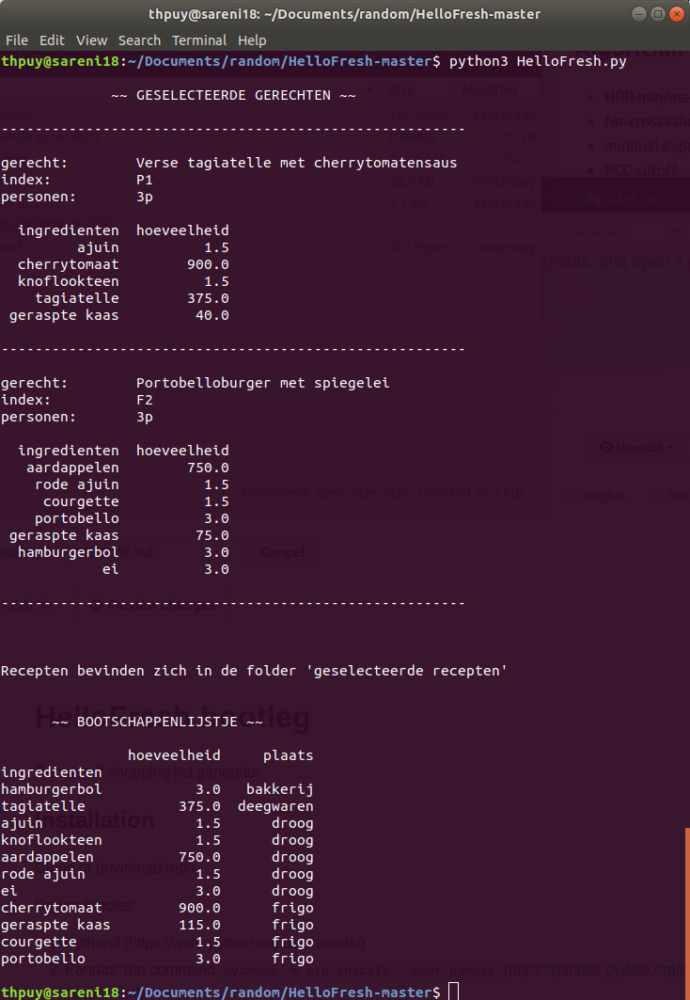
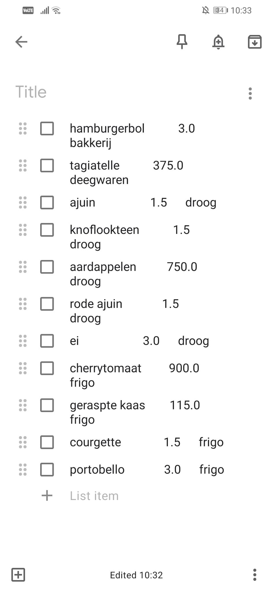

# HelloFresh bootleg
Recipes & shopping list generator

## Installation

Clone or download repo

Dependancies: 
  1) Python3 (https://www.python.org/downloads/)
  2) Pandas: run command ```python3 -m pip install --user pandas```  (https://pandas.pydata.org/pandas-docs/stable/install.html)

## Usage

1) Open ```HelloFresh_gerechten.xlsx``` and select recipes and amounts

  

2) Navigate to repo home folder and run command: 

  ```python3 HelloFresh.py```

  

3) copy paste into google keep & go shopping!

  

4) fetch recipe from folder *geselecteerde gerechten* and get cooking
